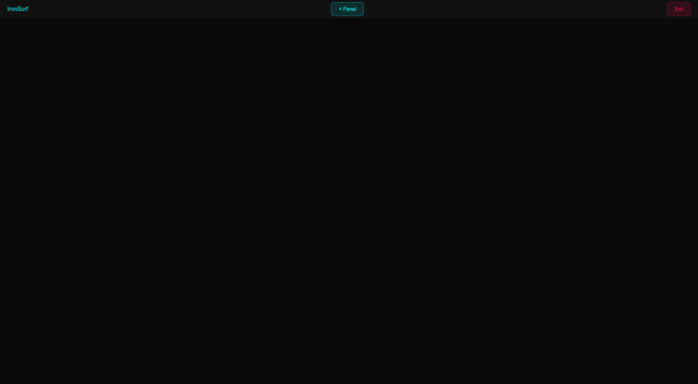
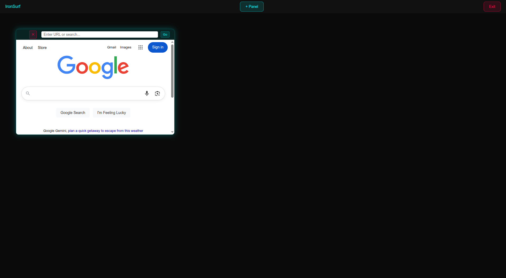
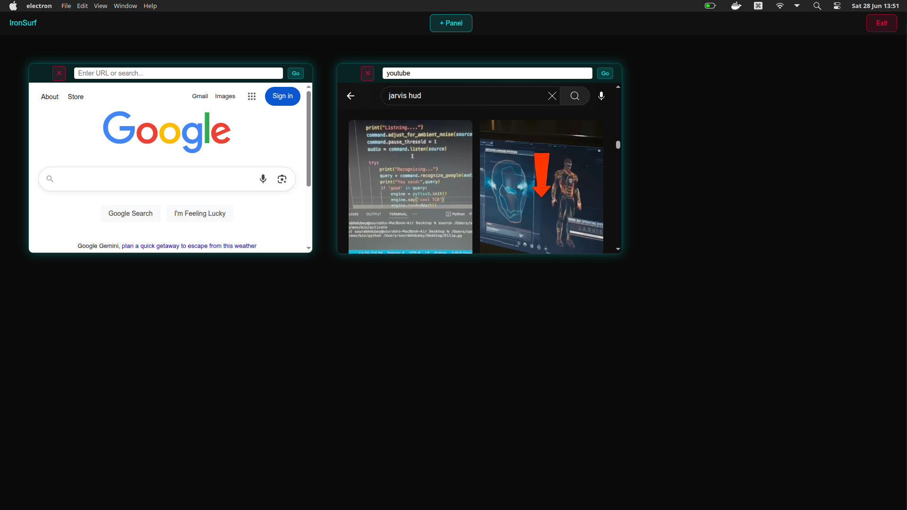

# IronSurf Browser

## Overview

IronSurf is a customizable, futuristic web browsing interface built with Electron. It enables users to launch and interact with multiple floating browser panels within a single app window, simulating a high-tech heads-up display (HUD) experience inspired by Tony Stark's Iron Man systems.

## Key Features

- **Multi-Panel Webviews**: Open multiple draggable, resizable browser panels simultaneously.

- **Smart Address Bar**: Accepts both direct URLs and search terms.

- **Floating Panel Controls**: Each panel can be moved, resized, and closed independently.

- **Minimalist Main Toolbar**: Includes buttons for adding new panels and closing the application.

- **Drag Zones & No-Drag Controls**: Designed with precise drag and interaction zones.
## Setup Instructions

### Prerequisites

- Node.js (v16 or newer recommended)

- Electron (installed via npm)

### Installation

Clone the repository:
```bash
git clone https://github.com/BalayogiG/IronSurf.git
cd IronSurf
npm init -y
npm install electron --save-dev
```    

### Folder Structure

```bash.
IronSurf
├── ./index.html
├── ./logo.jpeg
├── ./main.js
├── ./node_modules
├── ./package.json
└── ./preload.js
```
## Run Locally

Start the app from the IronSurf folder

```bash
npm start
```
## Controls

### Toolbar Buttons

- +Panel — Adds a new floating browser panel.

- Exit — Closes the application window.

### Inside Each Panel

- Drag Area — Empty space at the left of the header for dragging.

- Input Field — Enter URL or search query.

- Go Button — Navigates to the entered input.

- Close (✕) Button — Closes the panel.

## Screenshots





